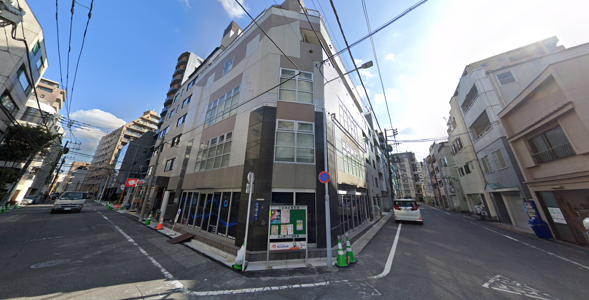

Here's the challenge:

_Attack of the Pentium 4 - 469 points (27 solves) at conclusion_

_You really want to play Run 3, but your poor Pentium 4 isn't fast enough! You've heard there's a computer shop worthy of thunderous praise in this building, but you need an expert opinion on their services first. If a computer is good enough to work on games, it should be good enough to play them. It’s been rumored that someone who works on games once purchased a computer from here. Can you find their first game?
Flag format: UMASS{name of the game in English}, for example UMASS{Elden Ring}_

My initial approach was...

Well, my initial approach was to submit `UMASS{Elden Ring}` because what if, lmao. After that, my initial approach was to find the location on Google Maps. From what I read on the UMASS CTF discord, there were four main points in this challenge where people stumbled:

1. Finding the physical location of the building.
2. Identifying the intended business inside.
3. Finding which of that business's customers is referenced in the question.
4. Figuring out what the English name of the first game is and how to format it for the flag.

Starting with #1, we're obviously supposed to assume this is Japan. The kanji on the blue sign (which we can't _really_ read yet) has accompanying furigana, there's a big よ on the red sign down the street to the left, etc. It feels like Japan. Also, the closest english word to the center of the image is "Japan." (in the URL on the window to the left.) 

Speaking of that URL...

Navigating to https://rad-japan.co.jp/ gives us a website without much English, but Chrome dutifully translates, and at the bottom we see:

After we plug in the address (in Japanese, though i assume English probably also works) we get the following:

That little bulletin board in the street view picture looks familiar! So this is the right building, but we need to figure out what the name of the computer shop in here is. What I ended up doing is just googling the address + "パソコン" for PC ("pasokon", from "personal computer"). There's probably an easier way.

The following two businesses are located in this building and seem to be associated with PCs:
* https://acharge-pc.com/
* https://www.wistech-ltd.com/

Wait a minute, acharge-pc is listed on the wistech-ltd website. So it's really one company and they've got the following brands (the four links from wistech-ltd.com:

* https://vspec-bto.com/
* https://acharge-pc.com/ (hello again)
* https://hercules21.jp/
* https://pc-zeus.com/

Well, that woman with the headset is working extremely hard to do support for all these websites! But, I'm not sure which direction to go from here. If only there were a heavy-handed clue in the... that's it! _You've heard there's a computer shop worthy of thunderous praise in this building_. Thunderous praise, huh? If that isn't PC-Zeus then I'm getting a new hobby. So let's see...

At this point I went **way** down the wrong rabbit hole. I figured some famous western gamedev had once purchased a PC-Zeus machine and maybe mentioned it in an interview. So I lost hours to trawling news stories and interviews and stuff, but that's the fun (citation needed) of OSINT. Eventually I figured out that the answer might be on the PC-Zeus site itself, if we're looking for a testimonial. Or maybe there's a page on the site that's like "Famous People That Shopped Here" and Sid Meier's face is going to be on it. Not sure, but let's start digging.

* https://pc-zeus.com/voice/
* https://pc-zeus.com/example.html

There are basically two "testimonial" pages on here. There's probably a much faster way to do it, but I just clicked each one, let Chrome translate, and then clicked away once I found out they weren't in gaming. The "Voice" page actually has the full comments on the main page so you don't have to click into each one. (that is, _you_ don't have to. I did. Oops.) But after not coming up with any promising Video Game industry people in Voice, I started digging through 'example'. If you have the main page (https://pc-zeus.com/example.html) translated via Chrome, a lot of the stories will say "Animation Company" or "Documentary Film Director" or whatever so you don't have to waste time clicking into those. 

The second link on the Example page is "Mr. Shohei Tsuchiya from Kanagawa Prefecture", who happily informs us in the interview's first question that he is a music producer and that he [mainly makes background music for games.](https://pc-zeus.com/example_13.html)

Interesting! Anything I might have heard of? Let's find out: https://vgmdb.net/artist/4827

It appears (click "Products") that Mr. Tsuchiya's first game was Otogi 2: Immortal Warriors. And that's the flag.
